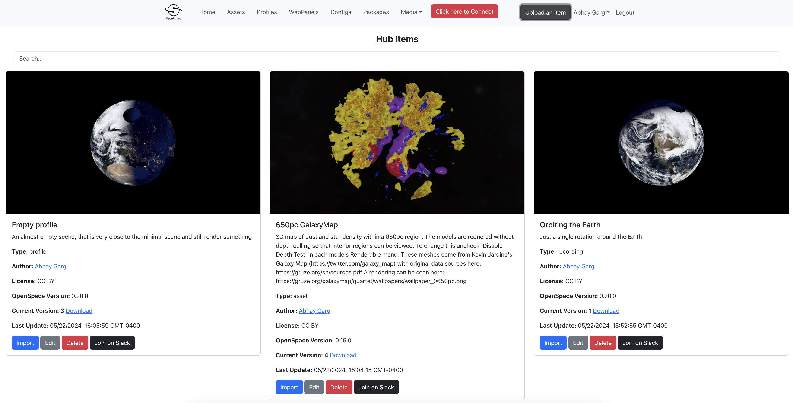
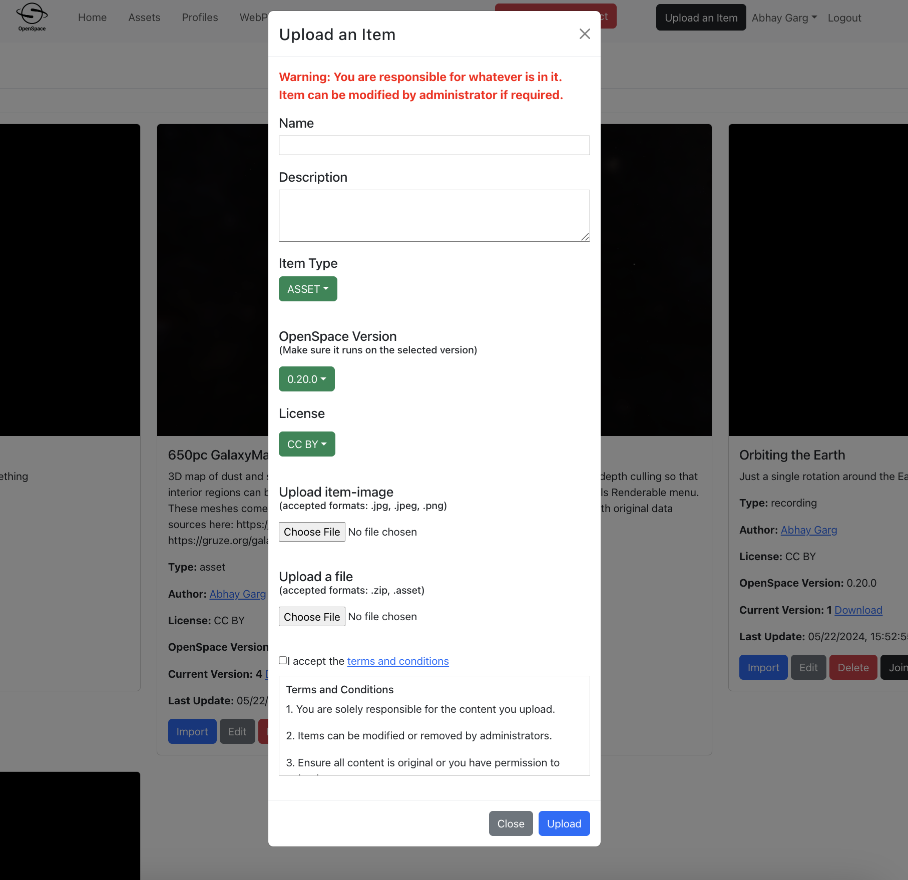

Openspace-Hub
=============

Welcome to the OpenSpace Hub. Here you will find items (assets, profiles, recordings, webpanels, videos, configs, packages) built by the community. Download them or use the Import button when OpenSpace is running to have OpenSpace download them for you.


Setup Instructions
====================================

To deploy the system locally using docker-compose, follow those step:

Set up environment
------------------
Copy env.default to .env inside frontend folder and update the variables there. 
```
cd frontend
cp .env.default .env
```

Build the containers
--------------------
Navigate to the root directory of the repository (OpenSpace-Hub folder) and build docker-compose.yaml file.
```
cd ../
docker-compose build
```

Start the base containers
-------------------------
```
docker-compose up
``` 

Note:
If you are running on a non-standard architecture (such as ARM), then you need to use bcryptjs instead of bcrypt.


Access the server on http://localhost:9000/





Old Server: [https://hub.openspaceproject.com](https://hub.openspaceproject.com/)